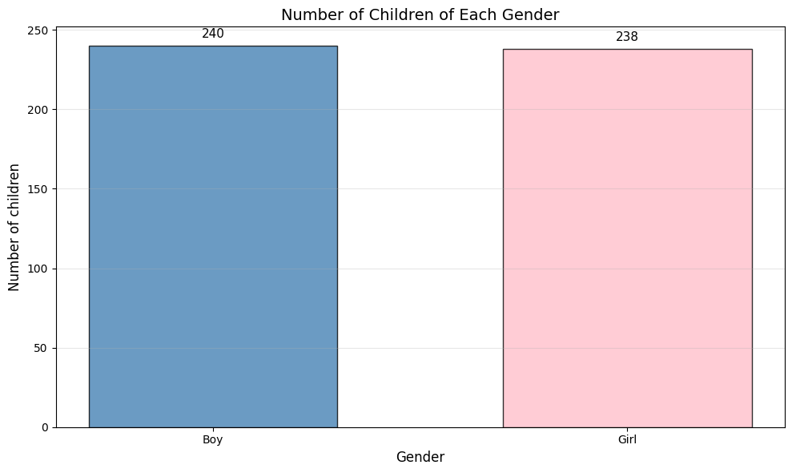
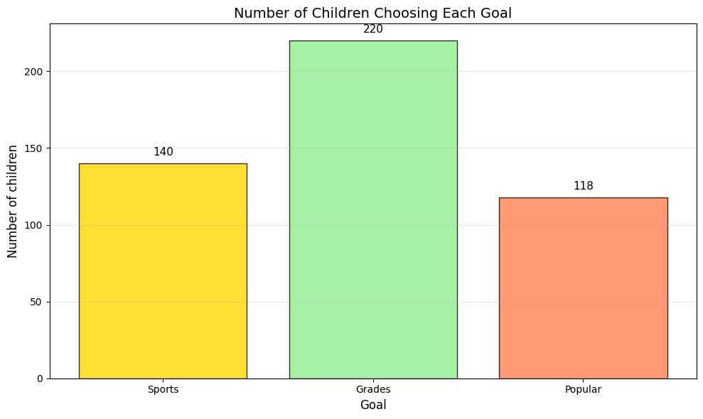
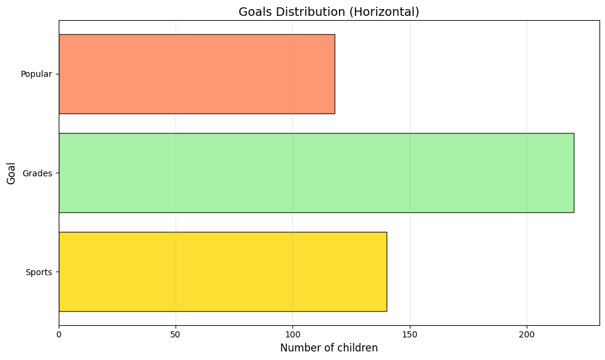
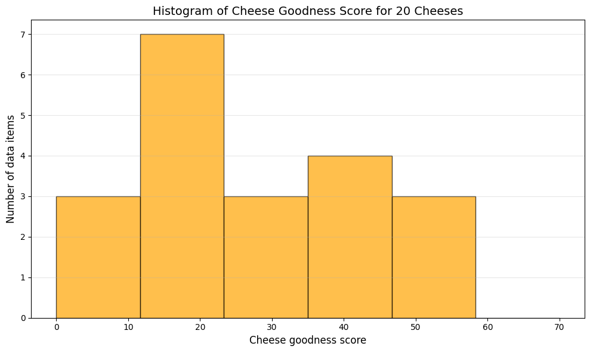
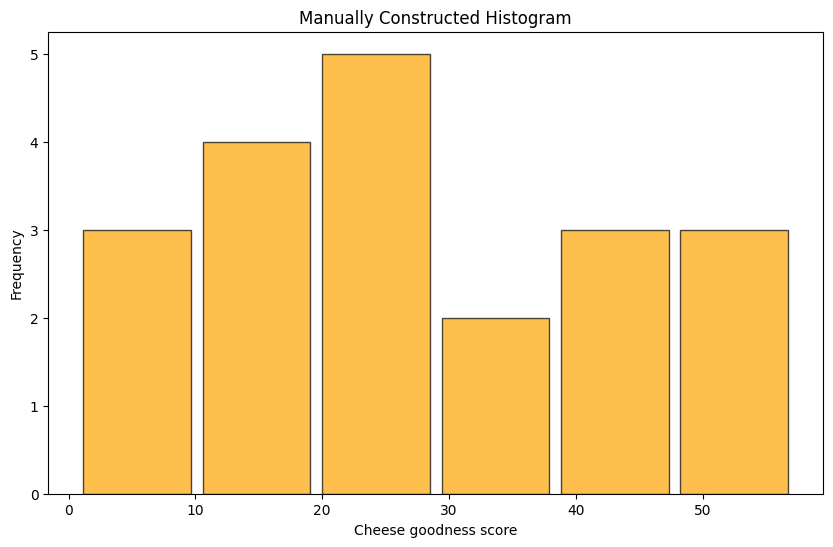
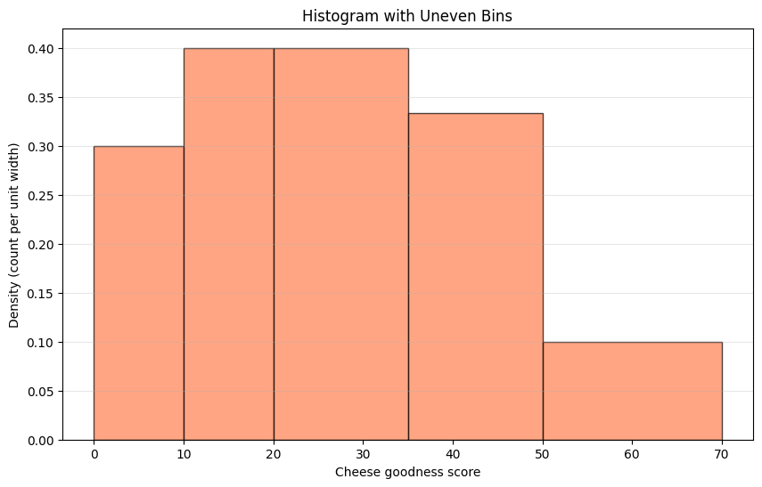
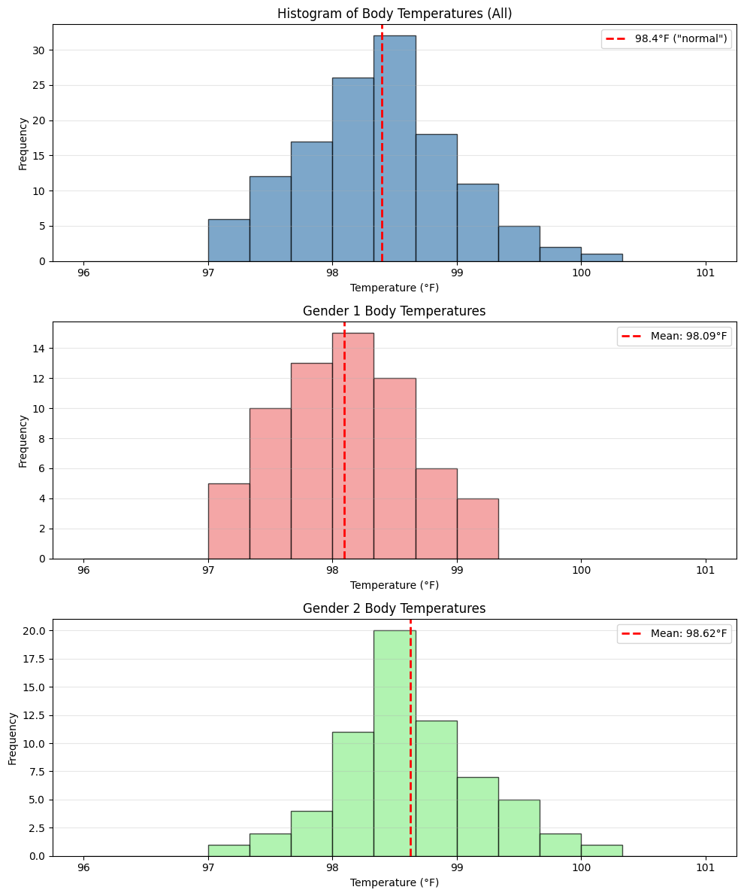

# 1.2 What's Happening? Plotting Data

The simplest way to present a dataset is with a table, but tables become unwieldy for large datasets. **Visualization** is key to understanding data - plots reveal patterns, outliers, and structure that tables obscure.

This section introduces fundamental plotting techniques for one-dimensional (1D) data:
- **Bar charts** for categorical data
- **Histograms** for continuous data
- **Conditional histograms** for comparing groups

## 1.2.1 Bar Charts

A **bar chart** displays categorical data with bars whose heights represent the frequency of each category.

### Definition

For categorical data with $k$ categories, a bar chart consists of:
- $k$ bars, one per category
- Height of each bar = count (or proportion) of items in that category
- Bars are typically separated by gaps

### When to Use Bar Charts

Bar charts are ideal for:
- **Categorical variables** (gender, goals, preferences)
- **Small number of categories** (typically < 20)
- **Comparing frequencies** across categories
- **Non-ordinal data** (though can be used for ordinal too)

### Example 1: Gender Distribution

The Chase and Danner study recorded gender for 478 students:
- **Boys**: 240 students (50.2%)
- **Girls**: 238 students (49.8%)

The bar chart immediately shows roughly equal gender distribution:

```python
import matplotlib.pyplot as plt
import numpy as np

# Data
genders = ['Boy', 'Girl']
counts = [240, 238]

# Create bar chart
plt.figure(figsize=(10, 6))
plt.bar(genders, counts, color=['steelblue', 'pink'], 
        alpha=0.8, edgecolor='black', width=0.6)
plt.ylabel('Number of children', fontsize=12)
plt.xlabel('Gender', fontsize=12)
plt.title('Number of Children of Each Gender', fontsize=14)
plt.grid(axis='y', alpha=0.3)

# Add value labels on bars
for i, (gender, count) in enumerate(zip(genders, counts)):
    plt.text(i, count + 5, str(count), ha='center', fontsize=11)

plt.tight_layout()
plt.show()
```

**Output:**



**Interpretation**: The bars are approximately equal height, indicating roughly equal numbers of boys and girls in the study.

### Example 2: Goals of Students

The same study asked students what they valued most:
- **Grades**: 220 students (46.0%)
- **Popular**: 118 students (24.7%)
- **Sports**: 140 students (29.3%)

```python
goals = ['Sports', 'Grades', 'Popular']
goal_counts = [140, 220, 118]

plt.figure(figsize=(10, 6))
colors = ['gold', 'lightgreen', 'coral']
plt.bar(goals, goal_counts, color=colors, alpha=0.8, edgecolor='black')
plt.ylabel('Number of children', fontsize=12)
plt.xlabel('Goal', fontsize=12)
plt.title('Number of Children Choosing Each Goal', fontsize=14)
plt.grid(axis='y', alpha=0.3)

for i, count in enumerate(goal_counts):
    plt.text(i, count + 5, str(count), ha='center', fontsize=11)

plt.tight_layout()
plt.show()
```

**Output:**



**Interpretation**: At a glance, we see that "Grades" is the most popular goal, followed by "Sports", then "Popular".

### Horizontal vs Vertical Bars

Bar charts can be oriented vertically (standard) or horizontally:

```python
# Horizontal bar chart
plt.figure(figsize=(10, 6))
plt.barh(goals, goal_counts, color=colors, alpha=0.8, edgecolor='black')
plt.xlabel('Number of children', fontsize=12)
plt.ylabel('Goal', fontsize=12)
plt.title('Goals Distribution (Horizontal)', fontsize=14)
plt.grid(axis='x', alpha=0.3)
plt.tight_layout()
plt.show()
```

**Output:**



**Use horizontal bars when**:
- Category names are long
- You have many categories
- Comparing magnitudes is more important than categorical order

## 1.2.2 Histograms

A **histogram** displays the distribution of continuous data by grouping values into intervals (bins) and plotting the frequency of values in each bin.

### Definition

A histogram consists of:
- **Bins**: intervals that partition the data range
- **Bars**: one per bin, with area proportional to frequency
- **No gaps** between bars (unlike bar charts)

### Why Histograms?

Continuous data often has few or no repeated values. A bar chart would produce many unit-height bars - not informative! Histograms group nearby values to reveal the **distribution shape**.

### Example 1: Net Worth Data

Ten people in a bar have net worths (in dollars):

| Person | Net Worth |
|--------|----------|
| 1 | $100,360 |
| 2 | $109,770 |
| 3 | $96,860 |
| 4 | $97,860 |
| 5 | $108,930 |
| 6 | $124,330 |
| 7 | $101,300 |
| 8 | $112,710 |
| 9 | $106,740 |
| 10 | $120,170 |

**Mean**: $107,903  
**Std Dev**: $9,265

```python
net_worth = np.array([100360, 109770, 96860, 97860, 108930, 
                      124330, 101300, 112710, 106740, 120170])

# Convert to $100,000s for easier reading
net_worth_100k = net_worth / 100000

plt.figure(figsize=(10, 6))
plt.hist(net_worth_100k, bins=5, edgecolor='black', 
         alpha=0.7, color='steelblue')
plt.xlabel('Net worth (in $100,000s)', fontsize=12)
plt.ylabel('Number of data items', fontsize=12)
plt.title('Histogram of Net Worth for 10 Individuals', fontsize=14)
plt.grid(axis='y', alpha=0.3)
plt.tight_layout()
plt.show()
```

**Output:**


**Interpretation**: Net worths cluster around $107,500-$112,500. One person is noticeably wealthier (~$124,000).

### Example 2: Cheese Goodness Scores

20 cheeses rated on a "goodness" scale:

```python
cheese_scores = np.array([12.3, 20.9, 39, 47.9, 5.6, 25.9, 37.3, 
                          21.9, 18.1, 21, 34.9, 57.2, 0.7, 25.9, 
                          54.9, 40.9, 15.9, 6.4, 18, 38.9])

plt.figure(figsize=(10, 6))
plt.hist(cheese_scores, bins=6, range=(0, 70), 
         edgecolor='black', alpha=0.7, color='orange')
plt.xlabel('Cheese goodness score', fontsize=12)
plt.ylabel('Number of data items', fontsize=12)
plt.title('Histogram of Cheese Goodness Score for 20 Cheeses', fontsize=14)
plt.grid(axis='y', alpha=0.3)
plt.tight_layout()
plt.show()
```

**Output:**



**Interpretation**: 
- Most cheeses score between 10-30 (9 cheeses)
- Few cheeses score very high (>50: only 3 cheeses)
- Few cheeses score very low (<10: 3 cheeses)
- Distribution is somewhat **right-skewed** (long tail on right)

## 1.2.3 How to Make Histograms

### Histograms with Even Intervals

The standard approach uses **equally-sized bins**.

**Algorithm**:
1. Find $x_{\min}$ and $x_{\max}$
2. Choose number of bins $n$
3. Calculate bin width: $w = \frac{x_{\max} - x_{\min}}{n}$
4. Create bins: $[x_{\min}, x_{\min}+w), [x_{\min}+w, x_{\min}+2w), \ldots$
5. Count data items in each bin
6. Plot bars with height = count

**Important**: Each value must fall into exactly one bin:
- Use $[a, b)$ intervals (includes $a$, excludes $b$)
- Or $( a, b]$ intervals (excludes $a$, includes $b$)

```python
# Manual histogram calculation
def make_histogram(data, n_bins):
    x_min, x_max = data.min(), data.max()
    bin_width = (x_max - x_min) / n_bins
    
    # Create bin edges
    bin_edges = np.linspace(x_min, x_max, n_bins + 1)
    
    # Count items in each bin
    counts, _ = np.histogram(data, bins=bin_edges)
    
    # Bin centers for plotting
    bin_centers = (bin_edges[:-1] + bin_edges[1:]) / 2
    
    return bin_centers, counts, bin_width

# Example
bin_centers, counts, bin_width = make_histogram(cheese_scores, 6)

print(f"Bin Centers: {bin_centers}")
print(f"Counts: {counts}")
print(f"Bin Width: {bin_width:.2f}")

plt.figure(figsize=(10, 6))
plt.bar(bin_centers, counts, width=bin_width*0.9, 
        edgecolor='black', alpha=0.7, color='orange')
plt.xlabel('Cheese goodness score')
plt.ylabel('Frequency')
plt.title('Manually Constructed Histogram')
plt.show()
```

**Output:**
```
Bin Centers: [ 5.40833333 14.825      24.24166667 33.65833333 43.075      52.49166667]
Counts: [3 4 5 2 3 3]
Bin Width: 9.42
```




### Choosing the Number of Bins

Too few bins → loss of detail  
Too many bins → noisy, hard to interpret

**Rules of thumb**:

1. **Square root rule**: $n = \lceil \sqrt{N} \rceil$
2. **Sturges' rule**: $n = \lceil \log_2(N) \rceil + 1$
3. **Scott's rule**: $w = 3.5 \sigma N^{-1/3}$, then $n = \lceil \frac{x_{\max}-x_{\min}}{w} \rceil$

For $N=20$:
- Square root: $n = 5$ bins
- Sturges': $n = 6$ bins
- Try different values and see what reveals structure best!

### Histograms with Uneven Intervals

Sometimes equal-width bins leave some bins empty. **Uneven bins** can be more informative.

**Key principle**: When bins have different widths, plot so that **area** (not height) is proportional to frequency.

If bin has width $w_i$ and count $n_i$, plot height:
$$h_i = \frac{n_i}{w_i}$$

This ensures: Area = $h_i \times w_i = n_i$ (proportional to count)

```python
# Custom bin edges (uneven)
custom_bins = [0, 10, 20, 35, 50, 70]
counts_custom, bin_edges = np.histogram(cheese_scores, bins=custom_bins)

# Calculate widths and densities
bin_widths = np.diff(bin_edges)
densities = counts_custom / bin_widths  # Height proportional to density

print(f"Custom bin edges: {custom_bins}")
print(f"Counts: {counts_custom}")
print(f"Bin widths: {bin_widths}")
print(f"Densities (height): {densities}")

plt.figure(figsize=(10, 6))
plt.bar(bin_edges[:-1], densities, width=bin_widths, 
        align='edge', edgecolor='black', alpha=0.7, color='coral')
plt.xlabel('Cheese goodness score')
plt.ylabel('Density (count per unit width)')
plt.title('Histogram with Uneven Bins')
plt.grid(axis='y', alpha=0.3)
plt.show()
```

**Output:**
```
Custom bin edges: [0, 10, 20, 35, 50, 70]
Counts: [3 4 6 5 2]
Bin widths: [10 10 15 15 20]
Densities (height): [0.3        0.4        0.4        0.33333333 0.1       ]
```




## 1.2.4 Conditional Histograms

**Conditional histograms** (or **class-conditional histograms**) show the distribution of data for different subgroups.

### When to Use

- Comparing distributions across groups
- Investigating whether a variable (e.g., gender) affects another variable (e.g., temperature)
- Understanding heterogeneity in data

### Example: Body Temperature by Gender

Data: Body temperatures (°F) for 130 individuals (2 genders)

**Question**: Do different genders have different typical body temperatures?

```python
# Simulated body temperature data
np.random.seed(42)
temp_gender1 = np.random.normal(98.2, 0.6, 65)  # Gender 1
temp_gender2 = np.random.normal(98.6, 0.6, 65)  # Gender 2
all_temp = np.concatenate([temp_gender1, temp_gender2])

print(f"Gender 1: Mean = {temp_gender1.mean():.2f}°F, Std = {temp_gender1.std():.2f}°F")
print(f"Gender 2: Mean = {temp_gender2.mean():.2f}°F, Std = {temp_gender2.std():.2f}°F")
print(f"Overall: Mean = {all_temp.mean():.2f}°F, Std = {all_temp.std():.2f}°F")

# Create figure with 3 subplots
fig, axes = plt.subplots(3, 1, figsize=(10, 12))

# Overall histogram
axes[0].hist(all_temp, bins=15, range=(96, 101), 
             color='steelblue', alpha=0.7, edgecolor='black')
axes[0].set_xlabel('Temperature (°F)')
axes[0].set_ylabel('Frequency')
axes[0].set_title('Histogram of Body Temperatures (All)')
axes[0].axvline(98.4, color='red', linestyle='--', 
                linewidth=2, label='98.4°F ("normal")')
axes[0].legend()
axes[0].grid(axis='y', alpha=0.3)

# Gender 1 histogram
axes[1].hist(temp_gender1, bins=15, range=(96, 101), 
             color='lightcoral', alpha=0.7, edgecolor='black')
axes[1].set_xlabel('Temperature (°F)')
axes[1].set_ylabel('Frequency')
axes[1].set_title('Gender 1 Body Temperatures')
axes[1].axvline(temp_gender1.mean(), color='red', 
                linestyle='--', linewidth=2, 
                label=f'Mean: {temp_gender1.mean():.2f}°F')
axes[1].legend()
axes[1].grid(axis='y', alpha=0.3)

# Gender 2 histogram
axes[2].hist(temp_gender2, bins=15, range=(96, 101), 
             color='lightgreen', alpha=0.7, edgecolor='black')
axes[2].set_xlabel('Temperature (°F)')
axes[2].set_ylabel('Frequency')
axes[2].set_title('Gender 2 Body Temperatures')
axes[2].axvline(temp_gender2.mean(), color='red', 
                linestyle='--', linewidth=2, 
                label=f'Mean: {temp_gender2.mean():.2f}°F')
axes[2].legend()
axes[2].grid(axis='y', alpha=0.3)

plt.tight_layout()
plt.show()
```

**Output:**
```
Gender 1: Mean = 98.09°F, Std = 0.54°F
Gender 2: Mean = 98.62°F, Std = 0.58°F
Overall: Mean = 98.36°F, Std = 0.62°F
```




**Interpretation**:
- Overall distribution clusters around 98.4°F
- Gender 1 runs slightly cooler (centered ~98.2°F)
- Gender 2 runs slightly warmer (centered ~98.6°F)
- The difference might be real, not just sampling variation

### Overlapping Conditional Histograms

Alternatively, plot both distributions on the same axes:

```python
plt.figure(figsize=(10, 6))
plt.hist(temp_gender1, bins=15, range=(96, 101), 
         alpha=0.6, label='Gender 1', color='coral', edgecolor='black')
plt.hist(temp_gender2, bins=15, range=(96, 101), 
         alpha=0.6, label='Gender 2', color='lightgreen', edgecolor='black')
plt.xlabel('Temperature (°F)', fontsize=12)
plt.ylabel('Frequency', fontsize=12)
plt.title('Body Temperature Distribution by Gender (Overlapping)', fontsize=14)
plt.legend(fontsize=11)
plt.grid(axis='y', alpha=0.3)
plt.tight_layout()
plt.show()
```

**Output:**


**Advantages**: Direct visual comparison  
**Disadvantages**: Can be cluttered if groups overlap heavily

## Summary

### Bar Charts vs Histograms

| Feature | Bar Chart | Histogram |
|---------|-----------|----------|
| **Data Type** | Categorical | Continuous |
| **Gaps between bars** | Yes | No |
| **What height represents** | Count/frequency | Count or density |
| **Bin reordering** | Can reorder categories | Cannot reorder (ordered by value) |
| **Use for** | Categories, discrete groups | Distributions, continuous variables |

### Key Takeaways

1. **Visualize first, summarize second** - plots reveal structure that tables hide
2. **Bar charts** show frequencies of categories at a glance
3. **Histograms** reveal distribution shape, center, spread, and skewness
4. **Conditional histograms** compare distributions across groups
5. **Bin choice matters** - experiment to find what reveals structure
6. **Always label axes** with units and clear descriptions

### Checklist for Good Plots

- [ ] Clear, descriptive title
- [ ] Axes labeled with units
- [ ] Appropriate bin width (histograms)
- [ ] Colors enhance readability (not just decoration)
- [ ] Legend when multiple series
- [ ] Grid lines (subtle) to aid reading values
- [ ] No chart junk - keep it simple

## Common Pitfalls

### 1. Too Many/Too Few Bins

- Too few: Lose detail, smooth over important features
- Too many: Noisy, hard to see overall pattern
- **Solution**: Try 3-5 different bin counts, pick most informative

### 2. Misleading Axes

- Not starting y-axis at zero can exaggerate differences
- Truncated axes hide true proportions
- **Solution**: Start at zero for bar charts, use judgment for histograms

### 3. Poor Color Choices

- Low contrast makes categories hard to distinguish
- Too many colors create confusion
- **Solution**: Use colorblind-friendly palettes, limit to 5-7 colors

### 4. Ignoring Distributions

- Summarizing with mean/median without looking at distribution
- Missing bimodality, outliers, skewness
- **Solution**: Always plot first!

## Practice Problems

1. **Test Scores**: Create a histogram for [85, 92, 78, 90, 88, 95, 100, 72, 86, 91, 84, 89, 93, 76, 88]
   - Try 3, 5, and 8 bins
   - Which reveals the distribution best?

2. **Categorical Analysis**: Given survey data (50 prefer A, 30 prefer B, 80 prefer C, 40 prefer D)
   - Create a bar chart
   - Add percentages to each bar

3. **Conditional Comparison**: Given test scores for two classes:
   - Class A: [85, 90, 88, 92, 86, 91, 89, 87]
   - Class B: [78, 82, 80, 79, 81, 83, 77, 84]
   - Create overlapping histograms
   - Which class performed better?

## Next Steps

→ Continue to [1.3 Summarizing 1D Data](ch01_summarizing.md) for numerical summaries

→ See [1.4 Plots and Summaries](ch01_plots_summaries.md) for advanced visualization techniques