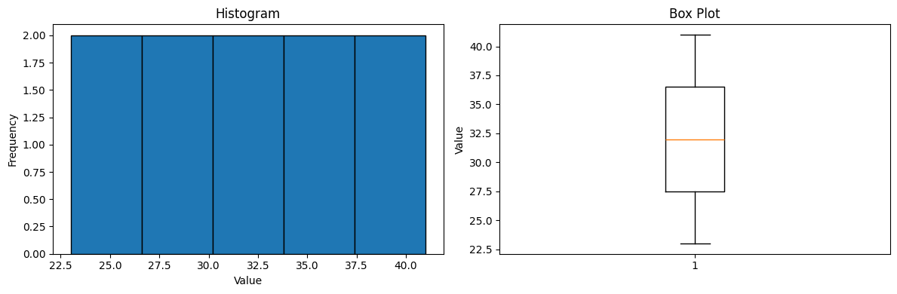

# 1.6 You Should

This section summarizes the key concepts, definitions, and skills you should have mastered from Chapter 1.

## 1.6.1 Remember These Definitions

**Definition 1.1: Mean**
$$\text{mean}(\{x\}) = \frac{1}{N} \sum_{i=1}^{N} x_i$$

The mean is the average value of a dataset.

**Definition 1.2: Standard Deviation**
$$\text{std}(\{x\}) = \sqrt{\frac{1}{N} \sum_{i=1}^{N} (x_i - \text{mean}(\{x\}))^2}$$

The standard deviation measures the typical deviation from the mean.

**Definition 1.3: Variance**
$$\text{var}(\{x\}) = \frac{1}{N} \sum_{i=1}^{N} (x_i - \text{mean}(\{x\}))^2 = (\text{std}(\{x\}))^2$$

The variance is the square of the standard deviation.

**Definition 1.4: Median**

The median is the middle value when data is sorted. For even-length datasets, it's the average of the two middle values.

**Definition 1.5: Percentile**

The k-th percentile is the value such that k% of the data is less than or equal to that value.

**Definition 1.6: Quartiles**
- **Q1** (first quartile): 25th percentile
- **Q2** (second quartile): 50th percentile (median)
- **Q3** (third quartile): 75th percentile

**Definition 1.7: Interquartile Range (IQR)**
$$\text{IQR} = Q3 - Q1$$

The IQR measures the spread of the middle 50% of the data.

**Definition 1.8: Standard Coordinates (Z-scores)**
$$\tilde{x}_i = \frac{x_i - \text{mean}(\{x\})}{\text{std}(\{x\})}$$

Standard coordinates normalize data to have mean 0 and standard deviation 1.

**Definition 1.9: Standard Normal Data**

Data is standard normal if its histogram (with many data points) approximates:
$$y(x) = \frac{1}{\sqrt{2\pi}} e^{-x^2/2}$$

**Definition 1.10: Normal Data**

Data is normal if it becomes standard normal after computing standard coordinates.

## 1.6.2 Remember These Terms

- **Dataset**: A collection of observations or measurements
- **Categorical data**: Data that falls into discrete categories
- **Ordinal data**: Categorical data that can be ordered
- **Continuous data**: Data that can take any value in a range
- **Bar chart**: Visualization showing category frequencies
- **Histogram**: Visualization showing distribution of continuous data
- **Conditional histogram**: Histogram for a subset of data
- **Location parameter**: A measure of where data is centered (mean, median)
- **Scale parameter**: A measure of data spread (standard deviation, IQR)
- **Outlier**: An unusually extreme data value
- **Skewness**: Asymmetry in the distribution of data
  - **Right-skewed**: Long right tail, mean > median
  - **Left-skewed**: Long left tail, mean < median
- **Mode**: The peak of a histogram
- **Unimodal**: One peak
- **Bimodal**: Two peaks
- **Multimodal**: Multiple peaks
- **Box plot**: Visualization showing five-number summary

## 1.6.3 Remember These Facts

### Properties of the Mean
1. Scaling data scales the mean: $\text{mean}(\{kx_i\}) = k \cdot \text{mean}(\{x_i\})$
2. Translating data translates the mean: $\text{mean}(\{x_i + c\}) = \text{mean}(\{x_i\}) + c$
3. Sum of deviations from mean is zero: $\sum_{i=1}^{N} (x_i - \text{mean}(\{x_i\})) = 0$
4. The mean minimizes sum of squared distances: $\text{argmin}_a \sum_i (x_i - a)^2 = \text{mean}(\{x\})$

### Properties of Standard Deviation
1. Translation doesn't change std: $\text{std}(\{x_i + c\}) = \text{std}(\{x_i\})$
2. Scaling scales std: $\text{std}(\{kx_i\}) = |k| \cdot \text{std}(\{x_i\})$
3. At most $\frac{1}{k^2}$ of data can be k or more standard deviations from the mean
4. At least one data point must be at least one standard deviation from the mean

### Properties of Variance
1. $\text{var}(\{x + c\}) = \text{var}(\{x\})$
2. $\text{var}(\{kx\}) = k^2 \cdot \text{var}(\{x\})$

### Properties of Median
1. $\text{median}(\{x + c\}) = \text{median}(\{x\}) + c$
2. $\text{median}(\{kx\}) = k \cdot \text{median}(\{x\})$
3. Median is robust to outliers

### Properties of Standard Coordinates
1. $\text{mean}(\{\tilde{x}\}) = 0$
2. $\text{std}(\{\tilde{x}\}) = 1$

### Properties of Normal Data
For normal data:
- About 68% lies within 1 standard deviation of the mean
- About 95% lies within 2 standard deviations of the mean
- About 99.7% lies within 3 standard deviations of the mean

This is the **68-95-99.7 rule** or **empirical rule**.

## 1.6.4 Be Able to

### Computation Skills
1. **Calculate** mean, median, standard deviation, variance, and IQR for a dataset
2. **Compute** percentiles and quartiles
3. **Convert** data to standard coordinates (z-scores)
4. **Identify** outliers using the IQR method (values < Q1 - 1.5×IQR or > Q3 + 1.5×IQR)

### Visualization Skills
1. **Create** bar charts for categorical data
2. **Create** histograms for continuous data
3. **Create** conditional histograms to compare subgroups
4. **Create** box plots to compare distributions
5. **Interpret** these visualizations to understand data structure

### Analysis Skills
1. **Identify** whether data is skewed (left, right, or symmetric)
2. **Determine** if data is unimodal, bimodal, or multimodal
3. **Choose** appropriate summary statistics (mean vs. median, std vs. IQR)
4. **Recognize** when data appears to be normally distributed
5. **Compare** multiple datasets using appropriate visualizations

### Conceptual Understanding
1. **Explain** why mean is sensitive to outliers but median is not
2. **Explain** why standard deviation measures spread
3. **Explain** what standard coordinates achieve
4. **Explain** the relationship between histogram shape and summary statistics
5. **Explain** when to use different types of plots

## Python Skills You Should Have

```python
import numpy as np
import matplotlib.pyplot as plt

# Create sample data
data = np.array([23, 25, 27, 29, 31, 33, 35, 37, 39, 41])

# Compute summary statistics
print(f"Mean: {np.mean(data)}")
print(f"Median: {np.median(data)}")
print(f"Std Dev: {np.std(data)}")
print(f"Variance: {np.var(data)}")
print(f"Q1: {np.percentile(data, 25)}")
print(f"Q3: {np.percentile(data, 75)}")
print(f"IQR: {np.percentile(data, 75) - np.percentile(data, 25)}")

# Standardize
z_scores = (data - np.mean(data)) / np.std(data)
print(f"Z-scores: {z_scores}")

# Create visualizations
fig, axes = plt.subplots(1, 2, figsize=(12, 4))

# Histogram
axes[0].hist(data, bins=5, edgecolor='black')
axes[0].set_xlabel('Value')
axes[0].set_ylabel('Frequency')
axes[0].set_title('Histogram')

# Box plot
axes[1].boxplot(data)
axes[1].set_ylabel('Value')
axes[1].set_title('Box Plot')

plt.tight_layout()
plt.show()
```

**Output:**
```
Mean: 32.0
Median: 32.0
Std Dev: 5.744562646538029
Variance: 33.0
Q1: 27.5
Q3: 36.5
IQR: 9.0
Z-scores: [-1.5666989  -1.21854359 -0.87038828 -0.52223297 -0.17407766  0.17407766
  0.52223297  0.87038828  1.21854359  1.5666989 ]
```




## Self-Check Questions

1. If you multiply every data point by 3, what happens to the mean? The standard deviation?
2. If you add 10 to every data point, what happens to the mean? The standard deviation?
3. Why might median be better than mean for describing income data?
4. What does it mean if a data point has a z-score of 2.5?
5. In a right-skewed distribution, which is larger: mean or median?
6. What percentage of normal data lies within 2 standard deviations of the mean?
7. How would you identify outliers using the IQR method?
8. What's the difference between a bar chart and a histogram?

## Next Steps

You're now ready to move on to **Chapter 2: Looking at Relationships**, where you'll learn about:
- Scatter plots
- Correlation
- Prediction using correlation
- 2D data visualization

→ Continue to [Chapter 2](../part1/chapter02.md)
