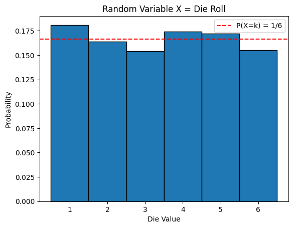
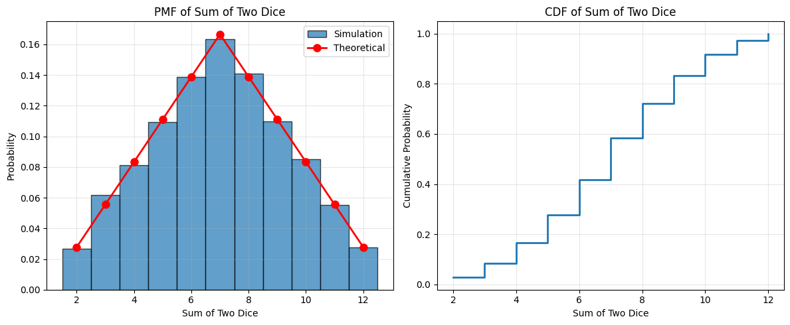
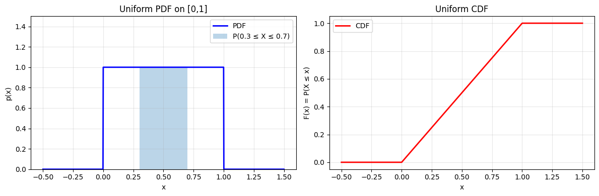
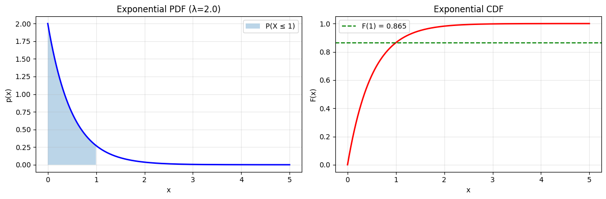

# 4.1 Random Variables

A **random variable** is a function that assigns a number to each outcome of a random experiment. This simple idea is incredibly powerful—it lets us work with numbers instead of abstract outcomes.

## Definition: Random Variable

A **random variable** $X$ is a function from the sample space $\Omega$ to the real numbers:
$$X: \Omega \rightarrow \mathbb{R}$$

For each outcome $\omega \in \Omega$, $X(\omega)$ is a real number.

### Example: Rolling a Die

Consider rolling a fair six-sided die:
- Sample space: $\Omega = \{1, 2, 3, 4, 5, 6\}$
- Random variable $X$: the number showing on the die
- $X(\omega) = \omega$ for each outcome $\omega$

```python
import numpy as np
import matplotlib.pyplot as plt

# Simulate rolling a die
np.random.seed(42)
rolls = np.random.randint(1, 7, size=1000)

plt.hist(rolls, bins=np.arange(0.5, 7.5, 1), edgecolor='black', density=True)
plt.xlabel('Die Value')
plt.ylabel('Probability')
plt.title('Random Variable X = Die Roll')
plt.xticks(range(1, 7))
plt.axhline(y=1/6, color='r', linestyle='--', label='P(X=k) = 1/6')
plt.legend()
plt.show()
```

**Output:**



## Discrete Random Variables

A random variable is **discrete** if it can take only a countable number of values.

### Probability Mass Function (PMF)

For a discrete random variable $X$, the **probability mass function** is:
$$p(x) = P(X = x)$$

This gives the probability that $X$ takes the specific value $x$.

**Properties of PMF**:
1. $p(x) \geq 0$ for all $x$
2. $\sum_{\text{all } x} p(x) = 1$

### Example: Sum of Two Dice

```python
# Simulate sum of two dice
die1 = np.random.randint(1, 7, size=10000)
die2 = np.random.randint(1, 7, size=10000)
sum_dice = die1 + die2

# Theoretical probabilities
values = range(2, 13)
theoretical_probs = {
    2: 1/36, 3: 2/36, 4: 3/36, 5: 4/36, 6: 5/36, 7: 6/36,
    8: 5/36, 9: 4/36, 10: 3/36, 11: 2/36, 12: 1/36
}

# Plot
plt.figure(figsize=(12, 5))

plt.subplot(1, 2, 1)
plt.hist(sum_dice, bins=np.arange(1.5, 13.5, 1), edgecolor='black', 
         density=True, alpha=0.7, label='Simulation')
plt.plot(values, [theoretical_probs[v] for v in values], 
         'ro-', linewidth=2, markersize=8, label='Theoretical')
plt.xlabel('Sum of Two Dice')
plt.ylabel('Probability')
plt.title('PMF of Sum of Two Dice')
plt.legend()
plt.grid(True, alpha=0.3)

plt.subplot(1, 2, 2)
cumulative_probs = np.cumsum([theoretical_probs[v] for v in values])
plt.step(values, cumulative_probs, where='post', linewidth=2)
plt.xlabel('Sum of Two Dice')
plt.ylabel('Cumulative Probability')
plt.title('CDF of Sum of Two Dice')
plt.grid(True, alpha=0.3)

plt.tight_layout()
plt.show()

print("\nProbability Mass Function:")
for k in values:
    print(f"P(X = {k:2d}) = {theoretical_probs[k]:.4f}")
```

**Output:**
```
Probability Mass Function:
P(X =  2) = 0.0278
P(X =  3) = 0.0556
P(X =  4) = 0.0833
P(X =  5) = 0.1111
P(X =  6) = 0.1389
P(X =  7) = 0.1667
P(X =  8) = 0.1389
P(X =  9) = 0.1111
P(X = 10) = 0.0833
P(X = 11) = 0.0556
P(X = 12) = 0.0278
```




## 4.1.1 Joint and Conditional Probability for Random Variables

When working with multiple random variables, we need to understand their joint and conditional behavior.

### Joint Probability

For discrete random variables $X$ and $Y$, the **joint probability mass function** is:
$$p(x, y) = P(X = x \text{ and } Y = y)$$

**Properties**:
1. $p(x, y) \geq 0$ for all $x, y$
2. $\sum_x \sum_y p(x, y) = 1$

### Marginal Probability

From the joint PMF, we can recover the individual PMFs:
$$p_X(x) = \sum_{y} p(x, y)$$
$$p_Y(y) = \sum_{x} p(x, y)$$

### Conditional Probability

The conditional probability of $X$ given $Y = y$ is:
$$p(x | y) = \frac{p(x, y)}{p_Y(y)}$$

provided $p_Y(y) > 0$.

### Example: Two Dice

```python
import pandas as pd

# Create joint probability table for two dice
joint_prob = {}
for d1 in range(1, 7):
    for d2 in range(1, 7):
        joint_prob[(d1, d2)] = 1/36

# Compute marginals
marginal_d1 = {k: 1/6 for k in range(1, 7)}
marginal_d2 = {k: 1/6 for k in range(1, 7)}

# Conditional: P(D1 = k | D1 + D2 = 7)
conditional_given_sum7 = {}
for d1 in range(1, 7):
    d2 = 7 - d1
    if 1 <= d2 <= 6:
        conditional_given_sum7[d1] = 1/6  # uniform on valid pairs

print("Joint Probability P(D1=1, D2=1):", joint_prob[(1, 1)])
print("\nMarginal P(D1=1):", marginal_d1[1])
print("\nConditional P(D1 | D1+D2=7):")
for k, p in conditional_given_sum7.items():
    print(f"  P(D1={k} | Sum=7) = {p:.4f}")
```

**Output:**
```
Joint Probability P(D1=1, D2=1): 0.027777777777777776

Marginal P(D1=1): 0.16666666666666666

Conditional P(D1 | D1+D2=7):
  P(D1=1 | Sum=7) = 0.1667
  P(D1=2 | Sum=7) = 0.1667
  P(D1=3 | Sum=7) = 0.1667
  P(D1=4 | Sum=7) = 0.1667
  P(D1=5 | Sum=7) = 0.1667
  P(D1=6 | Sum=7) = 0.1667
```


### Independence

Random variables $X$ and $Y$ are **independent** if:
$$p(x, y) = p_X(x) \cdot p_Y(y)$$

for all values $x$ and $y$.

Equivalently: $p(x | y) = p_X(x)$ for all $x, y$.

```python
# Check independence for two dice
print("\nIndependence Check:")
print(f"P(D1=1, D2=1) = {joint_prob[(1,1)]:.6f}")
print(f"P(D1=1) × P(D2=1) = {marginal_d1[1] * marginal_d2[1]:.6f}")
print(f"Independent: {np.isclose(joint_prob[(1,1)], marginal_d1[1] * marginal_d2[1])}")
```

**Output:**
```
Independence Check:
P(D1=1, D2=1) = 0.027778
P(D1=1) × P(D2=1) = 0.027778
Independent: True
```


## 4.1.2 Just a Little Continuous Probability

A random variable is **continuous** if it can take any value in some interval.

### Probability Density Function (PDF)

For a continuous random variable $X$, we use a **probability density function** $p(x)$ such that:
$$P(a \leq X \leq b) = \int_a^b p(x) \, dx$$

**Important**: For continuous random variables:
- $P(X = x) = 0$ for any specific value $x$
- Only intervals have non-zero probability
- $p(x)$ is a density, not a probability
- $p(x)$ can be greater than 1!

**Properties of PDF**:
1. $p(x) \geq 0$ for all $x$
2. $\int_{-\infty}^{\infty} p(x) \, dx = 1$

### Cumulative Distribution Function (CDF)

For any random variable (discrete or continuous), the **CDF** is:
$$F(x) = P(X \leq x)$$

For continuous $X$:
$$F(x) = \int_{-\infty}^{x} p(t) \, dt$$

And:
$$p(x) = \frac{dF(x)}{dx}$$

### Example: Uniform Distribution

A random variable $X$ is **uniformly distributed** on $[a, b]$ if:
$$p(x) = \begin{cases}
\frac{1}{b-a} & \text{if } a \leq x \leq b \\
0 & \text{otherwise}
\end{cases}$$

```python
from scipy import stats

# Uniform distribution on [0, 1]
x = np.linspace(-0.5, 1.5, 1000)
pdf = stats.uniform.pdf(x, loc=0, scale=1)
cdf = stats.uniform.cdf(x, loc=0, scale=1)

fig, (ax1, ax2) = plt.subplots(1, 2, figsize=(12, 4))

# PDF
ax1.plot(x, pdf, 'b-', linewidth=2, label='PDF')
ax1.fill_between(x, 0, pdf, where=(x>=0.3) & (x<=0.7), 
                  alpha=0.3, label='P(0.3 ≤ X ≤ 0.7)')
ax1.set_xlabel('x')
ax1.set_ylabel('p(x)')
ax1.set_title('Uniform PDF on [0,1]')
ax1.legend()
ax1.grid(True, alpha=0.3)
ax1.set_ylim([0, 1.5])

# CDF
ax2.plot(x, cdf, 'r-', linewidth=2, label='CDF')
ax2.set_xlabel('x')
ax2.set_ylabel('F(x) = P(X ≤ x)')
ax2.set_title('Uniform CDF')
ax2.legend()
ax2.grid(True, alpha=0.3)

plt.tight_layout()
plt.show()

print(f"P(0.3 ≤ X ≤ 0.7) = {stats.uniform.cdf(0.7) - stats.uniform.cdf(0.3):.2f}")
```

**Output:**
`P(0.3 ≤ X ≤ 0.7) = 0.40`




### Example: Exponential Distribution

The **exponential distribution** with rate $\lambda$ has PDF:
$$p(x) = \begin{cases}
\lambda e^{-\lambda x} & \text{if } x \geq 0 \\
0 & \text{if } x < 0
\end{cases}$$

Used to model waiting times.

```python
# Exponential distribution
lambda_rate = 2.0
x = np.linspace(0, 5, 1000)
pdf = stats.expon.pdf(x, scale=1/lambda_rate)
cdf = stats.expon.cdf(x, scale=1/lambda_rate)

fig, (ax1, ax2) = plt.subplots(1, 2, figsize=(12, 4))

ax1.plot(x, pdf, 'b-', linewidth=2)
ax1.fill_between(x, 0, pdf, where=(x<=1), alpha=0.3, label='P(X ≤ 1)')
ax1.set_xlabel('x')
ax1.set_ylabel('p(x)')
ax1.set_title(f'Exponential PDF (λ={lambda_rate})')
ax1.legend()
ax1.grid(True, alpha=0.3)

ax2.plot(x, cdf, 'r-', linewidth=2)
ax2.axhline(y=stats.expon.cdf(1, scale=1/lambda_rate), 
            color='g', linestyle='--', label=f'F(1) = {stats.expon.cdf(1, scale=1/lambda_rate):.3f}')
ax2.set_xlabel('x')
ax2.set_ylabel('F(x)')
ax2.set_title('Exponential CDF')
ax2.legend()
ax2.grid(True, alpha=0.3)

plt.tight_layout()
plt.show()

print(f"Mean waiting time: {1/lambda_rate:.2f}")
print(f"P(X ≤ 1) = {stats.expon.cdf(1, scale=1/lambda_rate):.3f}")
```

**Output:**
```
Mean waiting time: 0.50
P(X ≤ 1) = 0.865
```




## Summary

```{admonition} Key Takeaways
:class: important

1. **Random variables** map outcomes to numbers
2. **Discrete RVs** use probability mass functions (PMF)
3. **Continuous RVs** use probability density functions (PDF)
4. **Joint probability** describes multiple random variables together
5. **Conditional probability** for random variables works like events
6. **Independence**: $p(x,y) = p_X(x) \cdot p_Y(y)$
7. For continuous RVs, $P(X = x) = 0$ for any specific $x$
```

## Practice Problems

1. Define random variable $X$ = number of heads in 3 coin flips. Find $p(x)$ for all values.

2. For two dice, define $X$ = die 1 value, $Y$ = die 2 value, $Z$ = $X + Y$. Are $X$ and $Z$ independent?

3. If $X$ is uniform on $[0, 10]$, find $P(3 \leq X \leq 7)$.

4. For exponential distribution with $\lambda = 0.5$, find the probability of waiting more than 2 time units.

## Next Section

Now that we understand random variables, we can define their **expected values** and explore the powerful properties of expectations.

→ Continue to [4.2 Expectations and Expected Values](ch04_expectations.md)